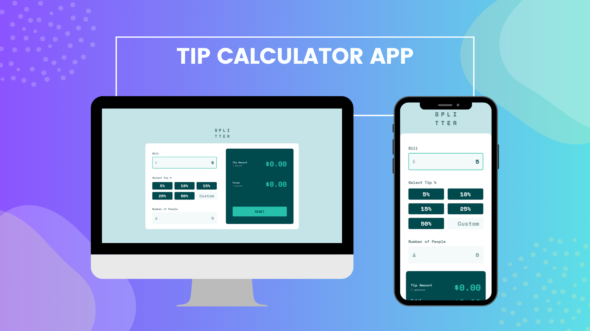

# Frontend Mentor - Tip calculator app solution

This is a solution to the [Tip calculator app challenge on Frontend Mentor](https://www.frontendmentor.io/challenges/tip-calculator-app-ugJNGbJUX). Frontend Mentor challenges help you improve your coding skills by building realistic projects.

## Table of contents

- [Overview](#overview)
  - [The challenge](#the-challenge)
  - [Screenshot](#screenshot)
  - [Links](#links)
- [My process](#my-process)
  - [Built with](#built-with)
  - [What I learned](#what-i-learned)
  - [Continued development](#continued-development)
  - [Useful resources](#useful-resources)
- [Author](#author)

## Overview

### The challenge

Users should be able to:

- View the optimal layout for the app depending on their device's screen size
- See hover states for all interactive elements on the page
- Calculate the correct tip and total cost of the bill per person

### Screenshot



### Links

- Solution URL: [https://github.com/erelita/coding-challenges/tree/main/frontendmentor/junior/tip-calculator-app-main](https://github.com/erelita/coding-challenges/tree/main/frontendmentor/junior/tip-calculator-app-main)
- Live Site URL: [https://tip-calculator-app-byer.netlify.app/](https://tip-calculator-app-byer.netlify.app/)

## My process

### Built with

- Semantic HTML5 markup
- CSS custom properties
- Flexbox
- Mobile-first workflow
- Javascript

### What I learned

Styling the input and button tags in CSS
```css
input[type=number] {
    -moz-appearance: textfield;
    cursor: pointer;
}

button[type=button] {
    color: var(--clr-neutral-100);
    font-family: var(--ft-primary);
    font-size: 1em;
    font-weight: 700;
    background-color: var(--clr-neutral-500);
    padding: 0.2em;
    border: none;
    border-radius: 5px;
    transition: 0.3s ease;
}
```

Using child selector and flex (shrink, grow, flex-basis)
```css
.calculator__form > * {
    flex: 1 1 350px;
}
```

Using querySelector + child selector in JS
```js
const billContainer = document.querySelector('.input__bill > .input__container');
```

Using addEventListener (keyup, focusin, focusout) in JS
```js
// Gives a highlighted border to container if input is in focus.
billInput.addEventListener('focusin', inputFocusIn);
// Sets border of container to warning color and display error message if input is out of focus and user didn't provide an input.
billInput.addEventListener('focusout', inputFocusOut);
// Computes for tip and total per person if user provided a custom tip %
tipCustom.addEventListener('keyup', computeOutput);
```

Using querySelectorAll + name attribute
```js
const tipSelect = document.querySelectorAll('[name="select-tip"]');

for (let i = 0; i < tipSelect.length; i++) {
    tipSelect[i].addEventListener('click', computeOutput);
}
```

Using Math.trunc and toFixed in JS
```js
// Computes tip / person
let tip = (billInput.value * (this.value / 100)) / peopleInput.value;
tipAmount.innerHTML = Math.trunc(tip * 100) / 100;
// Computes bill + tip / person
let total = (billInput.value / peopleInput.value) + tip;
totalAmount.innerHTML = total.toFixed(2);
```

### Continued development

- Hoping to learn more about forms using HTML, CSS and JS.

- I used a lot of things in JS that I haven't used or encountered before. Hoping to learn more JS in the next challenges that I will do.

- I want to understand more how to use __**this**__

### Useful resources

- [Truncate Two decimal places without rounding](https://coderedirect.com/questions/111633/truncate-two-decimal-places-without-rounding) - The tip amount per person is required to have 2 decimal places without rounding. Used the solution posted by user **vuliad**.
- [JavaScript Number toFixed()](https://www.w3schools.com/jsref/jsref_tofixed.asp) - Total bill amount per person is required to have 2 decimal places rounded. A good tutorial from W3School.
- [Flexbox design patterns you can use in your projects](https://www.youtube.com/watch?v=vQAvjof1oe4&t=467s) - A great video tutorial by Kevin Powell using flexbox. Helped me understood __flex__.
- [Adding click event listener to elements with the same class](https://stackoverflow.com/questions/21700364/adding-click-event-listener-to-elements-with-the-same-class/21700383) - Answer by user **dfsq** helped me understood how to add an event listener to the multiple buttons using __querySelectorAll__ with for loop.

## Author

- Website - [Erelita](https://github.com/erelita)
- Frontend Mentor - [@erelita](https://www.frontendmentor.io/profile/erelita)
