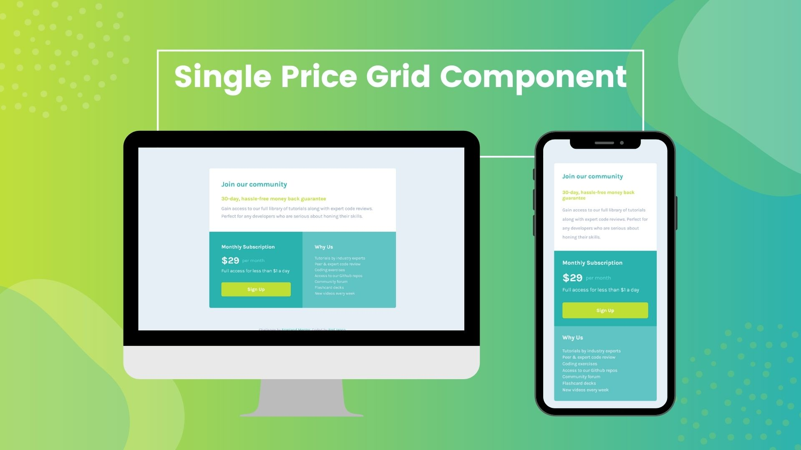

# Frontend Mentor - Single price grid component solution

This is a solution to the [Single price grid component challenge on Frontend Mentor](https://www.frontendmentor.io/challenges/single-price-grid-component-5ce41129d0ff452fec5abbbc). Frontend Mentor challenges help you improve your coding skills by building realistic projects.

[](https://app.netlify.com/sites/singlepricegrid-byerjapco/deploys)

## Table of contents

- [Overview](#overview)
  - [The challenge](#the-challenge)
  - [Screenshot](#screenshot)
  - [Links](#links)
- [My process](#my-process)
  - [Built with](#built-with)
  - [What I learned](#what-i-learned)
  - [Continued development](#continued-development)
  - [Useful resources](#useful-resources)
- [Author](#author)

## Overview

### The challenge

Users should be able to:

- View the optimal layout for the component depending on their device's screen size
- See a hover state on desktop for the Sign Up call-to-action

### Screenshot



### Links

- Solution URL: [https://github.com/erelita/frontendmentor/tree/main/newbie/single-price-grid-component-master](https://github.com/erelita/frontendmentor/tree/main/newbie/single-price-grid-component-master)
- Live Site URL: [https://singlepricegrid-byerjapco.netlify.app/](https://singlepricegrid-byerjapco.netlify.app/)

## My process

### Built with

- Semantic HTML5 markup
- CSS custom properties
- Flexbox
- Mobile-first workflow

### What I learned

**ARIA**

- Just watched Kevin Powell's video about section elements and made me realized that I haven't read the aria documentation. I probably should in the future. Still greatful that I'm learning to implement aria little by little.

```html
<section class="why-us" aria-labelledby="why-us__title">
  <h2 id="why-us__title" class="why-us__title">Why Us</h2>
  <ul class="why-us__list">
    <li class="why-us__list-item">Tutorials by industry experts</li>
    <li class="why-us__list-item">Peer & expert code review</li>
    <li class="why-us__list-item">Coding exercises</li>
    <li class="why-us__list-item">Access to our Github repos</li>
    <li class="why-us__list-item">Community forum</li>
    <li class="why-us__list-item">Flashcard decks</li>
    <li class="why-us__list-item">New videos every week</li>
  </ul>
</section>
```

**BEM**

- I think I have improved in implementing BEM in my CSS code. Hope to apply it more in the future because CSS codes looks clean and organized with it, in my opinion.

**MIN-WIDTH and MAX-WIDTH**

- This is the first time I used these two and I wish I have used before on other challenges. Less work needed on width responsiveness as it sets the limit the screen size go way beyond 1440px.

```css
.price-grid {
  width: 82vw;
  min-width: 310px;
  max-width: 635px;
  border-radius: 5px;
  font-family: var(--ft-primary);
  overflow: hidden;
}
```

**NETLIFY DEPLOYMENT**

- Finally figured out how to deploy a subdirectory on Netlify :)

### Continued development

**Responsiveness**

- I realized that I still need to learn and practice more to improve on web responsiveness. I have other solutions on Frontendmentor to which I need to go back to and work on their responsiveness. I am planning to take a course on Udemy which I'm hoping might help me to improve on HTML and CSS.

### Useful resources

- [Kevin Powell's HTML section elements are a lie (sort of)](https://youtu.be/ULdkpU51hTQ) - Proper usage of the section element.

## Author

- Website - [Erel Japco](https://github.com/ereljapco)
- Frontend Mentor - [@ereljapco](https://www.frontendmentor.io/profile/ereljapco)
